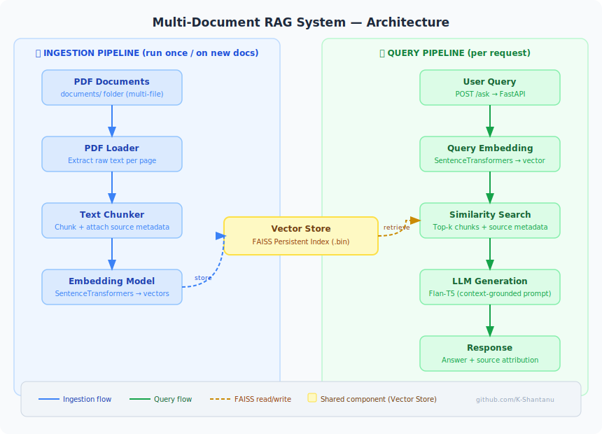

# RAG-Based Document Question Answering System

## Overview

This project implements a Retrieval-Augmented Generation (RAG) system for answering questions over multiple PDF documents.

The application allows users to ask natural language questions about a collection of documents. Instead of relying purely on a language model, the system retrieves relevant sections of documents using semantic search and generates answers grounded in the retrieved context.

The system runs locally and exposes a REST API using FastAPI. It also supports containerized deployment using Docker.

---

## Motivation

Large language models can produce incorrect or hallucinated responses when they lack access to relevant information. Retrieval-Augmented Generation addresses this limitation by retrieving relevant context from external data sources before generating a response.

This project demonstrates how to build a simple but complete RAG pipeline from scratch, including document ingestion, vector embeddings, similarity search, and answer generation.

---

## System Architecture

The system follows this pipeline:

1. Load multiple PDF documents  
2. Extract text from documents  
3. Split text into overlapping chunks  
4. Generate semantic embeddings for each chunk  
5. Store embeddings in a FAISS vector index  
6. Convert user queries into embeddings  
7. Retrieve the most relevant chunks using similarity search  
8. Provide retrieved context to a language model  
9. Generate an answer grounded in the retrieved information  

---

## Tech Stack

Python  
FastAPI  
SentenceTransformers  
FAISS (vector search)  
HuggingFace Transformers (Flan-T5)  
PyPDF  
Docker  

---

## Project Structure

```
rag_system/
│
├── app/
│   ├── main.py          # FastAPI application
│   ├── ingestion.py     # Document loading and chunking
│   ├── embedding.py     # Embedding generation
│   ├── retrieval.py     # FAISS index and similarity search
│   └── llm.py           # Answer generation
│
├── documents/           # Folder containing PDF files
│
├── Dockerfile
├── requirements.txt
└── README.md
```

---

## Key Features

- Multi-document PDF ingestion
- Text chunking with overlap
- Semantic embeddings using SentenceTransformers
- Vector similarity search using FAISS
- Context-grounded answer generation
- FastAPI REST API
- Docker containerization
- Persistent FAISS index for faster startup

---

## System Architecture

<p align="center">
  
</p>

## Running the Project Locally

### 1. Create a virtual environment

```
python -m venv venv
venv\Scripts\activate
```

### 2. Install dependencies

```
pip install -r requirements.txt
```

### 3. Start the server

```
uvicorn app.main:app --reload
```

Open the API documentation:

```
http://localhost:8000/docs
```

---

## Running with Docker

### Build the Docker image

```
docker build -t rag-system .
```

### Run the container

```
docker run -p 8000:8000 rag-system
```

Access the API:

```
http://localhost:8000/docs
```

---

## Example API Request

Endpoint:

POST `/ask`

Request body:

```json
{
  "question": "Who is the wife mentioned in the document?"
}
```

Example response:

```json
{
  "question": "...",
  "answer": "...",
  "retrieved_context": [
    {
      "text": "...",
      "source": "sample.pdf"
    }
  ]
}
```

---

## Limitations

- Uses a small local language model for demonstration purposes
- Answer quality depends on model size and context quality
- Designed as a learning and portfolio project rather than a production system

---

## Possible Improvements

- Use a larger language model
- Add reranking for improved retrieval quality
- Implement metadata filtering for document selection
- Add a simple frontend interface
- Deploy to a cloud environment

---

## Learning Outcomes

This project demonstrates:

- End-to-end RAG implementation
- Embedding-based semantic retrieval
- Vector search using FAISS
- Context-grounded answer generation
- API deployment with FastAPI
- Containerization using Docker